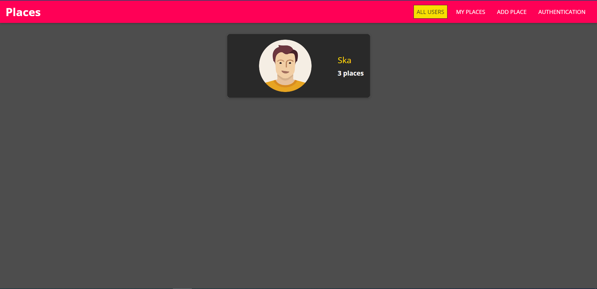

# Places-App

App where users can share places (with images and location) with others.

## Table of Contents
- [Installation](#installation)
- [Features](#features)

## Installation

To install and run this project, follow these steps:

1. Clone the repository:
   git clone https://github.com/Ska9/Places-App.git
   
2. cd Places-App
  
3. npm install

4. npm start

## Features

All CRUD (Create, Read, Update, Delete) methods covered.

Multiple data model, images upload, input validation.

Authentication and authorization required.

